 
# **End-to-end MLOps portfolio project using BigQuery, MLForecast, XGBoost, FastAPI, CI/CD, Alert System & Streamlit**
### 🌫️ Live Delhi PM2.5 Forecasting System  


This project is a production-inspired, fully automated PM2.5 air-quality forecasting system.  
It pulls data from **BigQuery**, trains a **time series machine learning model** (XGBoost using mlforecast library), monitors model performance, detects anomalies in performance, auto-retrains when needed, and serves forecasts through a **FastAPI endpoint** consumed by a **Streamlit dashboard**.

---

## 🎯 Project Goals & Learnings
* Goal: To learn and build a end-to-end MLOps pipeline.
* Learnings: Choosing the most suitable forecasting method still remains the biggest challenge.

---

### 📊 Live Dashboard Preview
<!-- This image is a link. Click it to open the App! -->
[](https://huggingface.co/spaces/namanparashar/delhi-aqi-forecast)

> *Click the image above to interact with the live dashboard.*

---

# 🚀 Features

### ✔ Automated data ingestion  
- Pulls Delhi weather's data from **Google BigQuery** using a service account.  
- Stores both a **future exogenous variables** and a **latest data**.

### ✔ Automated training pipeline  
- Model = **XGBoost + MLForecast** with lags + rolling windows   
- If current model's performance 10% better than previous model → model promoted to production  
- All metrics logged for reproducibility  

### ✔ Monitoring & anomaly detection  
- RMSE history stored  
- Day-over-day change  
- Resend API for alerts if model's performance degrades by 10%
- Version-level tracking of model quality  

### ✔ API service (FastAPI)  
- Always serves the **latest approved model.joblib**  
- Exposes `/forecast` endpoint (JSON output)  
- Lightweight, reproducible Docker container 

### ✔ Dashboard (Streamlit Cloud)  
- Shows historical PM2.5 trend  
- Shows 30-day forecast
- Shows latest actual value, average and maximum forecasted values
- Calls FastAPI live in the cloud   

### ✔ Docker & Deployment
- Packages both the FastAPI backend and Streamlit frontend into a single, portable artifact using a custom entrypoint.sh to manage concurrent processes
- Eliminates "works on my machine" issues by fixing Python versions, system libraries (like libgomp1 for XGBoost), and dependencies in an isolated environment
- Built on a lightweight python-slim base image running as a non-root user (UID 1000), compliant with strict security standards for serverless cloud platforms
- Deployed On Hugging Face

### ✔ CI/CD (GitHub Actions)  
Runs nightly:
- Fetch fresh data from BigQuery  
- Train model  
- Evaluate RMSE  
- If improved → commit new model  
- Push everything (model + metrics + latest CSVs)
- Alert if daily retrain workflow fails


---

# 📂 Architecture

```mermaid
graph TD

%% Data Ingestion
A["☁️ Google BigQuery"] -->|"Nightly Job"| B("GitHub Actions Runner")
B -->|"Fetch Data"| C[("data/air_quality_latest.csv")]

%% Training Pipeline
C --> D["Training Pipeline<br/>MLForecast + XGBoost"]
D -->|"Cross Validation"| E{"RMSE < Previous?"}

%% Branch: Model Degraded
E -->|"No (>10% worse)"| F["📧 Email Alert<br/>via Resend API"]

%% Branch: Model Improved
E -->|"Yes (Approved)"| G["💾 Save Model .joblib"]

%% Deployment Sync
G -->|"1. Commit & Push"| H["GitHub Repository<br/>(Source of Truth)"]
G -->|"2. Upload via SDK"| I["🤗 Hugging Face Spaces"]

%% Serving Layer
I -->|"Auto-Rebuild"| J["🐳 Docker Container"]
J -->|"entrypoint.sh"| K["FastAPI Backend<br/>port 8000"]
J -->|"entrypoint.sh"| L["Streamlit Dashboard<br/>port 7860"]

%% User Access
K <--> L
L -->|"Visuals"| M("End User")
```




# 🔄 Pipeline Workflow
The system operates on a 24-hour cycle, triggered automatically by GitHub Actions.

1. Automated Data Ingestion

  - Source: Fetches the latest PM2.5 and weather data from Google BigQuery.

  - Security: Uses Workload Identity Federation to authenticate with GCP without storing risky JSON Service Account keys in the repository.

2. Model Retraining & Evaluation

  - Training: A fresh XGBoost regressor is trained daily using mlforecast to capture recent trends and seasonality.

  - Validation: The model is evaluated against a holdout dataset (last 30 days).

  - Gatekeeping: The pipeline compares the new model's RMSE against the previous production model.

  - ✅ Improvement: If the error is stable or lower, the model is serialized (.joblib) and approved for deployment.

  - ❌ Degradation: If the error increases by >10%, the deployment is aborted, and an alert is sent via Resend API.

3. Deployment (The "Sync" Strategy)

  - Version Control: The new model and data artifacts are committed back to the GitHub repository to maintain a historical record.

  - Hugging Face Sync: A custom Python script uses the Hugging Face SDK to upload the binary model files directly to the Space. This bypasses Git LFS limitations and triggers an immediate rebuild.

4. Serving Layer (Dockerized)

  - Containerization: The application runs in a single Docker container on Hugging Face Spaces.

  - Concurrency: A custom entrypoint.sh script manages two parallel processes:

  - FastAPI Backend: Loads the model into memory to serve JSON predictions.

  - Streamlit Frontend: Consumes the API to render interactive Plotly charts for the end user.

---


# 🛠️ Tech Stack

| Layer | Tech |
|------|------|
| Data Source | BigQuery |
| Modeling | MLForecast, XGBoost |
| Serving | FastAPI, Uvicorn |
| Dashboard | Streamlit |
| Workflow | GitHub Actions |
| Packaging | Docker |
| Anomaly Alerts | Resend |

---

# ⚙️ Configuration

To fork and run this pipeline, you need to set up the following secrets in **GitHub Actions**:

| Secret Name | Description |
| :--- | :--- |
| `GCP_WORKLOAD_IDENTITY_PROVIDER` | The GCP OIDC provider string for keyless authentication. |
| `GCP_SERVICE_ACCOUNT` | The email of the Google Service Account with BigQuery access. |
| `RESEND_API_KEY` | API Key from [Resend](https://resend.com) for email alerts. |
| `HF_TOKEN` | Hugging Face Access Token (Write permissions) for deployment. |

**Environment Variables (Local `.env`):**
```ini
RESEND_API_KEY=re_12345...
API_URL=http://localhost:8000/forecast
```

---

# 🚀 How to Run Locally

You can run the entire pipeline locally using Docker.

### Prerequisites
* [Docker Desktop](https://www.docker.com/products/docker-desktop/) installed and running.
* Git installed.
* Python 3.10+ (if running manually).

### 1. Clone the Repository
```bash
git clone https://github.com/namannparashar/delhi-aqi-forecasting.git
cd delhi-aqi-forecasting
```

### 2. Build the image
```bash
docker build -t aqi-app .
```

### 3. Run the container
```bash
docker run -p 7860:7860 --env-file .env aqi-app
```

---

# 📄 License

This project is licensed under the MIT License - see the [LICENSE](LICENSE) file for details.
